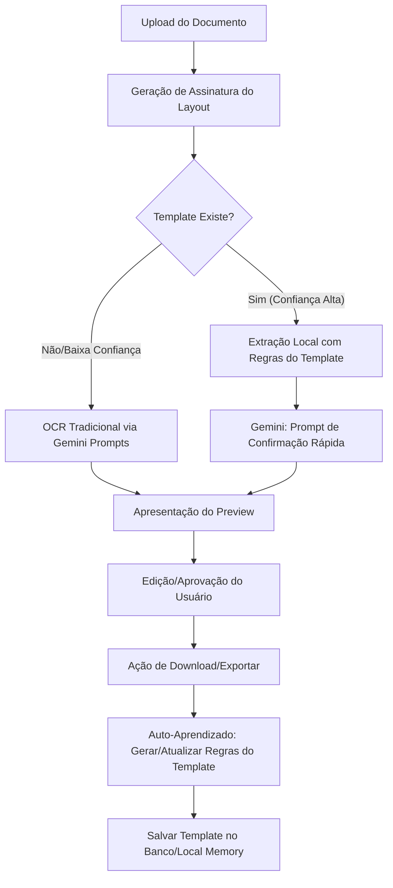

# Inteligência Adaptativa de OCR

Este documento descreve o design e as etapas de implementação para o sistema de **Inteligência Adaptativa de OCR** na aplicação `ocrperfis`. O principal objetivo é capacitar a aplicação a aprender novos layouts de documentos de forma autônoma a partir das análises da IA e das confirmações/correções feitas pelo usuário no momento do download do Preview. Com o tempo, a aplicação processará a maior parte dos documentos de forma local, reduzindo custos de API, latência e chances de timeout, utilizando a API do Gemini primariamente para validação/confirmação.

---

## 1. Visão Geral da Arquitetura

O sistema de Inteligência Adaptativa consiste em três pilares principais:



---

## 2. Componentes e Alterações Detalhadas

### 2.1. Assinatura e Mapeamento de Layout (`Layout Fingerprint`)
Quando um documento de texto digital (PDF, Excel, Word) ou imagem é enviado:
1. **Assinatura Textual:** Se for texto digital, normaliza-se as primeiras linhas de texto, cabeçalhos e termos estruturais. Gera-se um hash único (ex: baseado nos cabeçalhos detectados, ordenados alfabeticamente).
2. **Assinatura Espacial (Para Imagens):** Usar coordenadas relativas das caixas de texto (`box_2d`) identificadas no primeiro processamento para salvar o "esqueleto" visual do documento (onde ficam colunas de código, quantidade, etc.).

### 2.2. O Motor de Extração Local (`adaptiveOcr.ts`)
Um novo serviço em `src/services/adaptiveOcr.ts` será criado com:
* `generateLayoutSignature(text: string): string`: Gera a assinatura estrutural.
* `extractLocallyUsingTemplate(text: string, template: LayoutTemplate): OCRItem[]`: Utiliza padrões de regex aprendidos e ordens de colunas para obter os campos corretos.
* `learnTemplateFromConfirmation(rawText: string, finalItems: OCRItem[]): LayoutTemplate`: Algoritmo que deduz o layout mapeando a posição dos itens confirmados pelo usuário em relação ao texto bruto original.

### 2.3. Banco de Dados e Cache (`catalog_memory.json`)
A estrutura do cache do catálogo será atualizada para persistir as regras de layout aprendidas:
```json
{
  "templates": [
    {
      "signature": "hash_da_estrutura_a92f81",
      "profileKey": "BUDGET_TABLE",
      "verificationCount": 5,
      "confidence": 0.95,
      "rules": {
        "columnSeparator": "|",
        "productColIndex": 1,
        "quantityColIndex": 4,
        "lengthColIndex": 3,
        "finishColIndex": 2,
        "regexPattern": "..."
      }
    }
  ]
}
```

### 2.4. Integração no Pipeline Principal (`ocrService.ts`)
* No início de `performOCR`, a aplicação verificará se existe um template de confiança mapeado para a assinatura do documento.
* Se sim, executa a leitura local imediatamente.
* Em seguida, faz uma chamada ao Gemini utilizando um prompt extremamente curto apenas de verificação (ex: "Esses dados JSON extraídos correspondem a este documento? Responda SIM ou NÃO"), gastando uma fração mínima dos tokens usuais.
* Se a taxa de correspondência e confiança local for de 100% em documentos repetidos de texto digital, o acionamento da IA pode ser completamente omitido.

### 2.5. Ciclo de Aprendizado na Interface (`App.tsx`)
* A ação de **Download** ou **Exportar** no preview aciona uma chamada para `/api/learn-layout`.
* Essa chamada envia o texto bruto original e a tabela final de produtos editada pelo usuário.
* O sistema cria ou atualiza as coordenadas e regras do template para que erros de OCR corrigidos manualmente pelo usuário passem a ser aprendidos para as próximas leituras daquele tipo de documento.

---

## 3. Plano de Verificação

### 3.1. Validação com Arquivos Digitais
1. Fazer o upload de um orçamento PDF digital inédito. O sistema deve acionar o Gemini normalmente para a leitura e classificação.
2. Realizar ajustes em 2 itens que foram lidos errados e clicar em baixar o preview.
3. Confirmar que o template foi gerado e salvo em `catalog_memory.json` com os ajustes.
4. Fazer o upload de outro arquivo com o mesmo layout. O sistema deve processá-lo instantaneamente de forma local, já aplicando as correções salvas e exibindo no painel o indicador "Extraído via Inteligência Adaptativa (Local)".

### 3.2. Resiliência do Banco de Dados
* Validar persistência tanto local (no arquivo de desenvolvimento `catalog_memory.json`) quanto em produção no banco de dados do Supabase.
